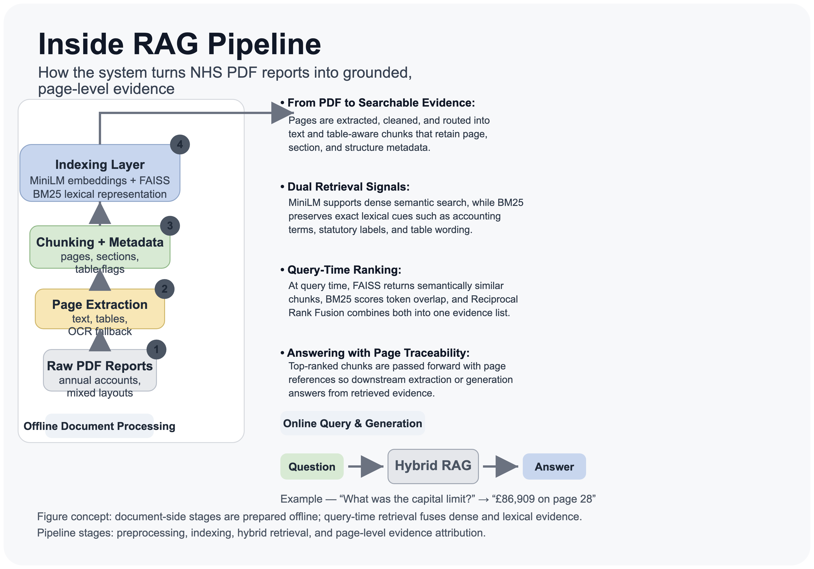
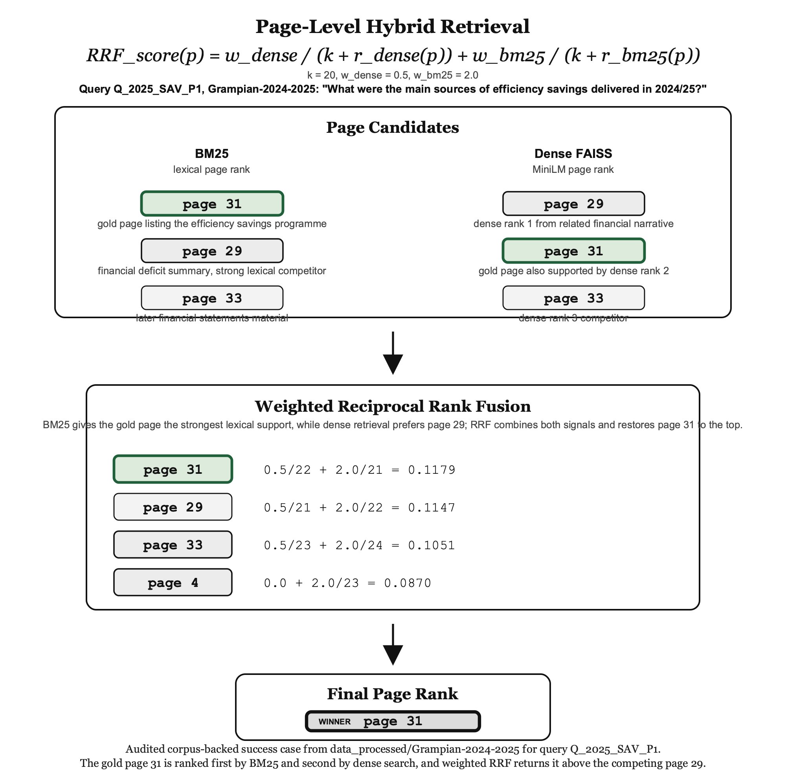

# NHS Annual Report RAG Pipeline

A local Retrieval-Augmented Generation pipeline for NHS Scotland annual accounts. Extracts, chunks, indexes, and retrieves answers from PDF annual reports across NHS Grampian and NHS Shetland (32 documents, 2004–2025).

---

## Architecture

### Full pipeline overview



Four sequential stages: PDF preprocessing → embedding + FAISS indexing → hybrid dense+sparse retrieval → grounded answer generation.

### Preprocessing pipeline


PyMuPDF extracts text; PDFPlumber covers low-quality pages as fallback. Header/footer boilerplate is stripped by coordinate crop. Tables are extracted separately via Camelot and injected back as structured markdown chunks. Pages with both table regions and substantial prose are routed to both extractors via **mixed routing**.

### Hybrid RRF retrieval



Dense retrieval (MiniLM-L6-v2, FAISS inner product on L2-normalised vectors) and sparse retrieval (BM25, rank-bm25) are fused using Reciprocal Rank Fusion. A lightweight lexical re-ranker applies section-aware table boosts, numeric density boosts, and entity overlap boosts post-fusion.

### Table-aware embedding


Table pages are chunked separately using one of four strategies (`baseline`, `row_preserving`, `row_blocks`, `two_stage`). Each table chunk carries a structured markdown header with column labels, section context, and page reference for retrieval grounding.

### Generation flow


Retrieved chunks are ranked, gated for citation quality and numeric consistency, then passed to a local Ollama model (default: `qwen2.5:7b-instruct`). Answers are returned with grounded chunk citations. Generation can be disabled with `LOCAL_LLM_ENABLED=0`.

---

## Retrieval Performance

Evaluated on 250 queries across 5 Grampian documents (2020–2025), 50 queries per document.

### Hybrid vs Dense retrieval (bootstrapped 95% CI)


Hybrid RRF consistently outperforms dense-only retrieval across all k values. Bootstrapped confidence intervals confirm the improvement is statistically reliable.

### Rank survival curve


Proportion of queries with their gold page still in the retrieved set as k grows. The pipeline achieves >94% page recall by k=10.

### Performance by query difficulty


Queries are stratified by difficulty (Easy/Medium/Hard/Very Hard). Hybrid retrieval gains are concentrated in the Medium and Hard tiers where BM25 term matching compensates for dense retrieval misses.

### Failure analysis (k=1)


FP taxonomy at k=1 across 50 queries per document. FP2 (missed top rank — answer exists in index but not retrieved first) accounts for the majority of failures, pointing to re-ranking as the primary remaining improvement opportunity.

---

## Corpus

| Trust | Documents | Years |
|---|---|---|
| NHS Grampian | 21 | 2004/05 – 2024/25 |
| NHS Shetland | 10 | 2015/16 – 2024/25 |
| Scottish Budget | 1 | 2024/25 |

32 documents indexed. 5 documents have labelled evaluation sets (250 questions total).

---

## Environment Setup

```bash
conda env create -f environment.yml
conda activate rag-pipeline
python scripts/check_environment.py --strict
```

Lightweight smoke install (skips optional packages):

```bash
conda env create -f environment_py312_smoke.yml
conda activate rag-pipeline
```

External binaries required for full table extraction:

```bash
brew install ghostscript poppler tesseract   # macOS
```

---

## Quickstart

### 1. Preprocess a PDF

```bash
python preprocess_hybrid.py \
  --pdf-path "Data/Grampian-2024-2025.pdf" \
  --mixed-routing
```

Outputs under `data_processed/<doc_id>/`:
`pages.parquet`, `sections.parquet`, `chunks.parquet`, `metrics.json`, `qa_report.json`

### 2. Build the FAISS index

```bash
python scripts/build_index.py \
  --data-dir data_processed \
  --device mps          # or cpu / cuda
```

Outputs per document: `faiss.index`, `embeddings.npy`, `chunk_meta.parquet`

### 3. Evaluate retrieval

```bash
python scripts/retrieval_eval.py \
  --data-dir data_processed/Grampian-2024-2025 \
  --device mps
```

Requires `eval_set.json` in the document directory. Outputs:
`retrieval_results.json`, `retrieval_metrics.json`, `retrieval_summary.csv`

### 4. Single query

```bash
python scripts/retrieve.py \
  --config configs/thesis_rag.yaml \
  --query "What was the Core Revenue Resource Limit for 2024/25?"
```

### 5. Batch reprocess all documents

```bash
bash scripts/rebuild_indexes_after_batch.sh
```

### 6. Launch the demo UI

```bash
# Start API (port 8000)
bash scripts/run_api_demo.sh

# Start Streamlit UI (port 8501)
bash scripts/run_streamlit_demo.sh
```

---

## API

The FastAPI service at `app/api/main.py` exposes:

| Endpoint | Method | Description |
|---|---|---|
| `/health` | GET | Liveness check |
| `/metrics` | GET | Generation observability counters |
| `/docs/list` | GET | List indexed documents |
| `/docs/upload` | POST | Upload and index a new PDF |
| `/docs/{doc_id}/search` | POST | Retrieve + optionally generate answer |
| `/docs/{doc_id}/rank` | POST | Re-rank a pre-supplied candidate set |
| `/docs/{doc_id}/stats` | GET | Document chunk/page statistics |
| `/docs/{doc_id}/tables` | GET | List extracted table chunks |
| `/docs/{doc_id}/eval` | GET | Return eval set items |

### Key environment variables

| Variable | Default | Description |
|---|---|---|
| `UI_MIXED_ROUTING` | `1` | Enable mixed-page routing on upload |
| `UI_TABLE_CHUNKING_MODE` | `baseline` | Table chunking strategy |
| `LOCAL_LLM_ENABLED` | `1` | Enable Ollama generation |
| `LOCAL_LLM_MODEL` | `qwen2.5:7b-instruct` | Ollama model name |
| `LOCAL_LLM_BASE_URL` | `http://127.0.0.1:11434` | Ollama endpoint |
| `TABLE_CHUNK_BOOST` | `0.08` | RRF score boost for table chunks |
| `TABLE_BOOST_ALLOWED_SECTION_PATTERNS` | `performance report,...` | Comma-separated section allow-list for table boost |
| `ENABLE_LEXICAL_RERANK` | `1` | Enable post-fusion lexical re-ranking |
| `ST_MODEL_DEVICE` | `cpu` | Embedding device (`cpu`, `mps`, `cuda`) |
| `API_KEY` | `` | Require `X-API-Key` header if set |
| `UPLOAD_ENABLED` | `0` | Allow PDF upload via API |

---

## Key Configuration (`configs/thesis_rag.yaml`)

| Section | Parameter | Default |
|---|---|---|
| `chunking` | `chunk_size_tokens` | 224 |
| `chunking` | `chunk_overlap_tokens` | 56 |
| `chunking` | `min_chunk_words` | 20 |
| `embedding` | `model_name` | `all-MiniLM-L6-v2` |
| `embedding` | `apply_l2_normalization` | `true` |
| `retrieval` | `rrf_k` | 60 |
| `retrieval` | `dense_top_k` | 20 |
| `retrieval` | `sparse_top_k` | 20 |
| `retrieval` | `hybrid_top_k` | 10 |
| `bm25` | `k1` | 1.5 |
| `bm25` | `b` | 0.75 |

---

## Eval Set Format

```json
{
  "_meta": { "doc_id": "Grampian-2024-2025" },
  "queries": [
    {
      "query_id": "Q_2025_FIN_01",
      "question": "What was the Core Revenue Resource Limit for 2024/25?",
      "expected_pages": [28],
      "expected_answer": "£1,234,567k",
      "answer_type": "number",
      "doc_id": "Grampian-2024-2025",
      "year": 2025
    }
  ]
}
```

---

## Failure Taxonomy

| Code | Stage | Description |
|---|---|---|
| `FP1_MISSING_CONTENT` | Retrieval | Gold page not in index |
| `FP2_MISSED_TOP_RANK` | Retrieval | Gold page indexed but not retrieved at k=1 |
| `FP3_NOT_IN_CONTEXT` | Retrieval | Gold page retrieved but answer not in context |
| `FP4_NOT_EXTRACTED` | Generation | Answer in context but extraction returns nothing |
| `FP5_WRONG_FORMAT` | Generation | Extracted answer wrong type |
| `FP6_INCORRECT_SPECIFICITY` | Generation | Wrong value despite correct context |
| `FP7_INCOMPLETE` | Generation | Answer partially matches |
| `HIT` | — | Correct answer retrieved and extracted |

---

## Project Layout

```
src/rag_pdf/          # Core library
  config.py           # PreprocessConfig, RegionConfig, TableDetectConfig
  retrieval/          # Hybrid retrieval, RRF, lexical re-ranking, question router
  services/           # Search, process, storage, LLM services
  chunking.py         # Token-aware overlapping chunk splitting
  table_detect.py     # Table boundary detection
  table_extract.py    # Camelot-based table extraction
  table_chunking.py   # Row-based table chunk strategies

app/
  api/main.py         # FastAPI service
  ui/streamlit_app.py # Streamlit demo UI

scripts/              # Pipeline entrypoints and experiment scripts
  preprocess_hybrid.py
  build_index.py
  retrieval_eval.py
  retrieve.py
  run_full_pipeline.py

configs/              # YAML pipeline configurations
tests/                # pytest unit tests (32 tests, 0 failures)
docs/architecture/    # Pipeline diagrams and infographics
data_processed/       # Per-document outputs (git-ignored)
```

---

## Tests

```bash
pytest tests/ -q
# 32 passed, 0 failed
```

---

## Notes

- FAISS uses `IndexFlatIP` on L2-normalised vectors (equivalent to cosine similarity).
- Mixed routing (`--mixed-routing`) detects pages with both table and prose regions and routes them to both Camelot extraction and text chunking. Enabled by default on API upload (`UI_MIXED_ROUTING=1`).
- The table priority boost fires only for chunks in allowed sections (configurable via `TABLE_BOOST_ALLOWED_SECTION_PATTERNS`) to prevent deep Notes to Accounts tables from outranking Performance Report summaries.
- If `check_environment.py --strict` fails on `camelot` or `gs`, table extraction will fall back to PDFPlumber text rendering.
- OCR fallback requires `tesseract` on PATH (`brew install tesseract poppler` on macOS).

---

## License

MIT License — see `LICENSE`.
