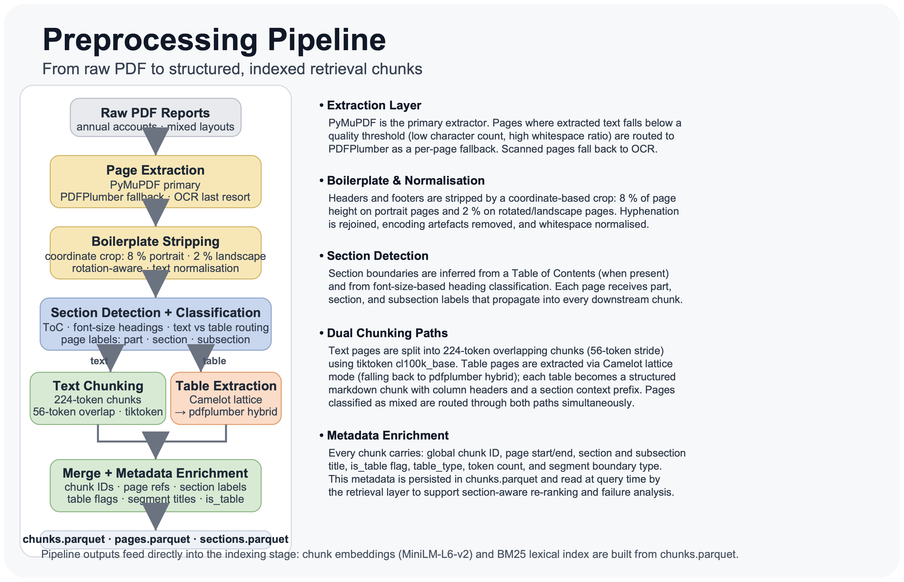
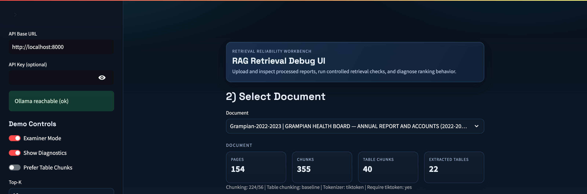

# NHS Annual Report RAG Pipeline

**Repository:** [EvidenceRAG-Evaluation](https://github.com/djimrastephane/EvidenceRAG-Evaluation)

A local Retrieval-Augmented Generation pipeline for NHS Scotland annual accounts. Extracts, chunks, indexes, and retrieves answers from PDF annual reports across NHS Grampian and NHS Shetland (31 documents, 2004–2025). The system is designed to run entirely on a standard computer: no GPU and no external/cloud LLM are required for generation, all embedding, retrieval, and generation run locally on CPU.

---

## Architecture

### Full pipeline overview


Four sequential stages: PDF preprocessing → embedding + FAISS indexing → hybrid dense+sparse retrieval → grounded answer generation.

### Preprocessing pipeline



PyMuPDF extracts text; PDFPlumber covers low-quality pages as fallback. Header/footer boilerplate is stripped by coordinate crop. Tables are extracted separately via Camelot and injected back as structured markdown chunks. Pages with both table regions and substantial prose are routed to both extractors via **mixed routing**.

### Hybrid RRF retrieval


Dense retrieval (MiniLM-L6-v2, FAISS inner product on L2-normalised vectors) and sparse retrieval (BM25, rank-bm25) are fused using Reciprocal Rank Fusion. A lightweight lexical re-ranker applies section-aware table boosts, numeric density boosts, and entity overlap boosts post-fusion.

### Table-aware embedding


Table pages are chunked separately using one of four strategies (`baseline`, `row_preserving`, `row_blocks`, `two_stage`). Each table chunk carries a structured markdown header with column labels, section context, and page reference for retrieval grounding.

### Generation flow


Retrieved chunks are ranked, gated for citation quality and numeric consistency, then passed to a local Ollama model (default: `qwen2.5:7b-instruct`). Answers are returned with grounded chunk citations. Generation can be disabled with `LOCAL_LLM_ENABLED=0`.

---

## Retrieval Performance

Evaluated on 250 queries across 5 Grampian documents (2020–2025), 50 queries per document.

### Summary (hybrid RRF, page-level)

| Document | Hit@1 | Hit@3 | Hit@5 | Hit@10 | MRR |
|---|---|---|---|---|---|
| Grampian 2020–2021 | 0.680 | 0.880 | 0.900 | 0.940 | 0.777 |
| Grampian 2021–2022 | 0.740 | 0.800 | 0.840 | 0.900 | 0.786 |
| Grampian 2022–2023 | 0.640 | 0.820 | 0.860 | 0.900 | 0.747 |
| Grampian 2023–2024 | 0.700 | 0.900 | 0.920 | 0.960 | 0.811 |
| Grampian 2024–2025 | 0.600 | 0.880 | 0.920 | 0.920 | 0.745 |
| **Mean** | **0.672** | **0.856** | **0.888** | **0.924** | **0.773** |

### Hybrid vs Dense retrieval (bootstrapped 95% CI)


Hybrid RRF consistently outperforms dense-only retrieval across all k values. Bootstrapped confidence intervals confirm the improvement is statistically reliable.

### Rank survival curve


Proportion of queries with their gold page still in the retrieved set as k grows. The pipeline achieves >94% page recall by k=10.

### Performance by query difficulty


Queries are stratified by difficulty (Easy/Medium/Hard/Very Hard). Hybrid retrieval gains are concentrated in the Medium and Hard tiers where BM25 term matching compensates for dense retrieval misses.

### Failure analysis (k=1)


FP taxonomy at k=1 across 50 queries per document. FP2 (missed top rank — answer exists in index but not retrieved first) accounts for the majority of failures, pointing to re-ranking as the primary remaining improvement opportunity.

### Embedding space (PCA by section type)


PCA projection of all 423 chunk embeddings from the 2024–2025 Grampian report, coloured by section type. Financial Statements chunks (red) cluster on the right; Performance Report and Accountability Report chunks (blue/orange) occupy the left. The spatial separation validates that MiniLM captures document structure without fine-tuning. An interactive Wizmap projection is available in the **Embedding Diagnostics** tab of the diagnostic UI.

---

## Corpus

| Trust | Documents | Years |
|---|---|---|
| NHS Grampian | 21 | 2004/05 – 2024/25 |
| NHS Shetland | 10 | 2015/16 – 2024/25 |

31 documents indexed. 5 documents have labelled evaluation sets (250 questions total).

---

## Environment Setup

```bash
conda env create -f environment.yml
conda activate rag-pipeline
python scripts/check_environment.py --strict
```

Lightweight smoke install (skips optional packages):

```bash
conda env create -f environment_py312_smoke.yml
conda activate rag-pipeline
```

External binaries required for full table extraction:

```bash
brew install ghostscript poppler tesseract   # macOS
```

Download the embedding model weights (required before starting the API):

```bash
python scripts/download_model.py
```

This populates `models/all-MiniLM-L6-v2/` from the HuggingFace Hub (or local cache). The API will raise `FileNotFoundError` at startup if this step is skipped. Pass `--force` to re-download.

---

## Quickstart

### 1. Preprocess a PDF

```bash
python preprocess_hybrid.py \
  --pdf-path "Data/Grampian-2024-2025.pdf" \
  --mixed-routing
```

Outputs under `data_processed/<doc_id>/`:
`pages.parquet`, `sections.parquet`, `chunks.parquet`, `metrics.json`, `qa_report.json`

### 2. Build the FAISS index

```bash
python scripts/build_index.py \
  --data-dir data_processed \
  --device mps          # or cpu / cuda
```

Outputs per document: `faiss.index`, `embeddings.npy`, `chunk_meta.parquet`

### 3. Evaluate retrieval

```bash
python scripts/retrieval_eval.py \
  --data-dir data_processed/Grampian-2024-2025 \
  --device mps
```

Requires `eval_set.json` in the document directory. Outputs:
`retrieval_results.json`, `retrieval_metrics.json`, `retrieval_summary.csv`

### 4. Single query

```bash
python scripts/retrieve.py \
  --config configs/thesis_rag.yaml \
  --query "What was the Core Revenue Resource Limit for 2024/25?"
```

### 5. Batch reprocess all documents

```bash
bash scripts/rebuild_indexes_after_batch.sh
```

### 6. Launch the demo UI

```bash
# Start API (port 8000)
bash scripts/run_api_demo.sh

# Start Streamlit UI (port 8501)
bash scripts/run_streamlit_demo.sh
```

---

## Diagnostic UI

> **This UI is a retrieval-reliability workbench for diagnosis only — it is not an end-user product.** It exists to upload and inspect processed reports, run controlled retrieval checks, and diagnose ranking behaviour during development and evaluation. It surfaces internal pipeline state (chunk metadata, RRF scores, table-boost decisions, embedding projections, generation debug fields) that would be irrelevant or confusing to an end user asking questions of an annual report.

<table>
<tr>
<td width="50%"><br><sub><b>Document selector</b> — pick any of the 31 indexed NHS annual reports; the stats strip shows page count, chunk count, table chunks extracted, and structured tables</sub></td>
<td width="50%"><br><sub><b>Retrieval tab</b> — ranked results from the hybrid RRF pipeline; the <em>Ranking margin</em> panel (Examiner Mode) shows fused scores and per-retriever raw scores, with <code>NULL</code> distinguishing BM25-only hits from genuine zero cosine scores</sub></td>
</tr>
<tr>
<td colspan="2"><br><sub><b>Full workbench view</b> — all 8 tabs visible: Retrieval, Tables, Chunk Inspector, Failure Audit, Embedding Diagnostics, Run Info, Pipeline Architecture, System Metrics</sub></td>
</tr>
</table>

The Streamlit app (`app/ui/streamlit_app.py`) is organised around a single document at a time, with tabs for:

| Tab | Purpose |
|---|---|
| **Retrieval** | Run a query through the live hybrid pipeline and inspect ranked chunks, RRF scores, and the generated answer with citations |
| **Tables** | Browse extracted table chunks for the selected document |
| **Chunk Inspector** | View raw chunk text, section context, and token counts |
| **Failure Audit** | Compare retrieved vs. expected pages against the eval set, broken down by failure type (FP1–FP4) |
| **Embedding Diagnostics** | UMAP/Wizmap projections of chunk embeddings to visually inspect clustering and outliers |
| **Run Info** | Pipeline configuration, chunking parameters, and indexing metadata for the loaded run |
| **Pipeline Architecture** | Static reference diagrams of the preprocessing, indexing, and retrieval stages |

Sidebar **Demo Controls** (`Examiner Mode`, `Show Diagnostics`, `Prefer Table Chunks`, `Top-K`) let you toggle between a simplified walkthrough view and the full diagnostic surface, and re-run retrieval with different fusion settings without restarting the API.

---

## API

The FastAPI service at `app/api/main.py` exposes:

| Endpoint | Method | Description |
|---|---|---|
| `/health` | GET | Liveness check |
| `/metrics` | GET | Generation observability counters |
| `/docs/list` | GET | List indexed documents |
| `/docs/upload` | POST | Upload and index a new PDF |
| `/docs/{doc_id}/search` | POST | Retrieve + optionally generate answer |
| `/docs/{doc_id}/rank` | POST | Re-rank a pre-supplied candidate set |
| `/docs/{doc_id}/stats` | GET | Document chunk/page statistics |
| `/docs/{doc_id}/tables` | GET | List extracted table chunks |
| `/docs/{doc_id}/eval` | GET | Return eval set items |

### Key environment variables

| Variable | Default | Description |
|---|---|---|
| `UI_MIXED_ROUTING` | `1` | Enable mixed-page routing on upload |
| `UI_TABLE_CHUNKING_MODE` | `baseline` | Table chunking strategy |
| `LOCAL_LLM_ENABLED` | `1` | Enable Ollama generation |
| `LOCAL_LLM_MODEL` | `qwen2.5:7b-instruct` | Ollama model name |
| `LOCAL_LLM_BASE_URL` | `http://127.0.0.1:11434` | Ollama endpoint |
| `TABLE_CHUNK_BOOST` | `0.08` | RRF score boost for table chunks |
| `TABLE_BOOST_ALLOWED_SECTION_PATTERNS` | `performance report,...` | Comma-separated section allow-list for table boost |
| `ENABLE_LEXICAL_RERANK` | `1` | Enable post-fusion lexical re-ranking |
| `ST_MODEL_DEVICE` | `cpu` | Embedding device (`cpu`, `mps`, `cuda`) |
| `API_KEY` | `` | Require `X-API-Key` header if set |
| `UPLOAD_ENABLED` | `0` | Allow PDF upload via API |

---

## Key Configuration (`configs/thesis_rag.yaml`)

| Section | Parameter | Default |
|---|---|---|
| `chunking` | `chunk_size_tokens` | 224 |
| `chunking` | `chunk_overlap_tokens` | 56 |
| `chunking` | `min_chunk_words` | 20 |
| `embedding` | `model_name` | `all-MiniLM-L6-v2` |
| `embedding` | `apply_l2_normalization` | `true` |
| `retrieval` | `rrf_k` | 60 |
| `retrieval` | `dense_top_k` | 20 |
| `retrieval` | `sparse_top_k` | 20 |
| `retrieval` | `hybrid_top_k` | 10 |
| `bm25` | `k1` | 1.5 |
| `bm25` | `b` | 0.75 |

---

## Eval Set Format

```json
{
  "_meta": { "doc_id": "Grampian-2024-2025" },
  "queries": [
    {
      "query_id": "Q_2025_FIN_01",
      "question": "What was the Core Revenue Resource Limit for 2024/25?",
      "expected_pages": [28],
      "expected_answer": "£1,234,567k",
      "answer_type": "number",
      "doc_id": "Grampian-2024-2025",
      "year": 2025
    }
  ]
}
```

---

## Failure Taxonomy

Taxonomy adapted from Scott Barnett, Stefanus Kurniawan, Srikanth Thudumu, Zach Brannelly, and Mohamed Abdelrazek. Seven failure points when engineering a retrieval-augmented generation system. In *Proceedings of the IEEE/ACM 3rd International Conference on AI Engineering – Software Engineering for AI*, pages 194–199, New York, NY, USA, April 2024. Association for Computing Machinery.

| Code | Stage | Description |
|---|---|---|
| `FP1_MISSING_CONTENT` | Retrieval | Gold page not in index |
| `FP2_MISSED_TOP_RANK` | Retrieval | Gold page indexed but not retrieved at k=1 |
| `FP3_NOT_IN_CONTEXT` | Retrieval | Gold page retrieved but answer not in context |
| `FP4_NOT_EXTRACTED` | Generation | Answer in context but extraction returns nothing |
| `FP5_WRONG_FORMAT` | Generation | Extracted answer wrong type |
| `FP6_INCORRECT_SPECIFICITY` | Generation | Wrong value despite correct context |
| `FP7_INCOMPLETE` | Generation | Answer partially matches |
| `HIT` | — | Correct answer retrieved and extracted |

---

## Project Layout

```
src/rag_pdf/          # Core library
  config.py           # PreprocessConfig, RegionConfig, TableDetectConfig
  retrieval/          # Hybrid retrieval, RRF, lexical re-ranking, question router
  services/           # Search, process, storage, LLM services
  chunking.py         # Token-aware overlapping chunk splitting
  table_detect.py     # Table boundary detection
  table_extract.py    # Camelot-based table extraction
  table_chunking.py   # Row-based table chunk strategies

app/
  api/main.py         # FastAPI service
  ui/streamlit_app.py # Streamlit demo UI

scripts/              # Pipeline entrypoints and experiment scripts
  preprocess_hybrid.py
  build_index.py
  retrieval_eval.py
  retrieve.py
  run_full_pipeline.py

configs/              # YAML pipeline configurations
tests/                # pytest unit tests (32 tests, 0 failures)
docs/architecture/    # Pipeline diagrams and infographics
data_processed/       # Per-document outputs (git-ignored)
```

---

## Tests

```bash
pytest tests/ -q
# 32 passed, 0 failed
```

`qa/test_preprocessing.py` and `qa/test2_preprocessing.py` are standalone diagnostic scripts (not pytest cases) that inspect a processed document's chunks and metrics for ligature artifacts and normalization settings. They point at `data_processed/Grampian-2024-2025` and require that doc to have been preprocessed first (see [Quickstart](#quickstart)):

```bash
python qa/test_preprocessing.py
python qa/test2_preprocessing.py
```

---

## Notes

- FAISS uses `IndexFlatIP` on L2-normalised vectors (equivalent to cosine similarity).
- Mixed routing (`--mixed-routing`) detects pages with both table and prose regions and routes them to both Camelot extraction and text chunking. Enabled by default on API upload (`UI_MIXED_ROUTING=1`).
- The table priority boost fires only for chunks in allowed sections (configurable via `TABLE_BOOST_ALLOWED_SECTION_PATTERNS`) to prevent deep Notes to Accounts tables from outranking Performance Report summaries.
- If `check_environment.py --strict` fails on `camelot` or `gs`, table extraction will fall back to PDFPlumber text rendering.
- OCR fallback requires `tesseract` on PATH (`brew install tesseract poppler` on macOS).

---

## Limitations

- **Hit@1 ceiling.** Mean page Hit@1 across the 5 evaluation cohorts is 0.672. Approximately one in three queries does not surface the correct page at rank 1. The rank survival curve shows strong recovery by k=5 (0.888), but top-1 precision remains the primary gap.
- **FP2 dominates failures.** The majority of k=1 failures are FP2 (correct page is indexed and retrievable but not ranked first), not FP1 (missing content). This points to re-ranking rather than indexing coverage as the bottleneck.
- **Fixed search window.** `MAX_K_SEARCH=100` caps how many chunks are retrieved from FAISS before BM25 fusion. For large documents (e.g. Grampian-2024-2025 with 423 chunks), BM25-only hits outside the top-100 dense window receive a `NULL` cosine score rather than a genuine zero — a known diagnostic artefact surfaced in the ranking margin panel.
- **Single-document scope.** Retrieval is scoped to one document at a time. There is no cross-document index or multi-document fusion; a query about trends across years requires running separately against each document.
- **Gold evaluation set.** The evaluation set consists of 250 queries derived from five NHS Grampian annual reports (2020/2021 to 2024/2025). Each query is manually verified and labelled with its known source page and document section to ensure a ground truth for performance measurement. Queries are categorised by difficulty: LEX (125, exact wording), MOD (75, paraphrased), and STR (50, requiring interpretation). The 50% LEX share gives a natural advantage to keyword-based retrieval. The pipeline is fully deterministic: 30 independent runs produced byte-for-byte identical outputs. All queries target the front narrative section of each report (typically pages 16–28); back-section financial statements are intentionally out of scope, as they are better suited to structured extraction tools.
- **Local LLM dependency.** Generation requires Ollama running locally. There is no cloud LLM fallback; disabling generation (`LOCAL_LLM_ENABLED=0`) returns retrieval results only.
- **Camelot/Ghostscript dependency.** Full table extraction requires Ghostscript and Camelot. Without them, table pages fall back to PDFPlumber text rendering, which loses table structure and degrades numeric retrieval on financial statement pages.
- **Temporal vocabulary drift.** Terminology in NHS reports shifts across the 2004–2025 span (e.g. HSMR framing, CRES targets). Cross-era queries using current terminology against early documents can fail at both dense and sparse retrieval due to vocabulary mismatch.

---

## Future Improvements

- **Neural re-ranking for FP2.** A cross-encoder (e.g. BGE reranker) applied to the top-20 fused candidates would directly address the dominant failure mode. Ablation scripts exist (`scripts/run_bge_reranker_ablation.py`, `scripts/run_cross_encoder_ablation.py`); latency vs accuracy trade-off is the remaining barrier to adoption.
- **Selective query rewriting.** Hard multi-part questions (difficulty tier Hard/Very Hard) would benefit from sub-question decomposition before retrieval. Rewriting hurt simple numeric lookups in ablation, so the gain requires a query-difficulty classifier to gate the rewriting step.
- **Multi-document retrieval.** A global FAISS index across all 31 documents would allow trend queries (e.g. "how did the capital resource limit change from 2010 to 2025?") to be answered in a single retrieval pass. `scripts/build_global_indexes.py` provides a starting point.
- **Domain-adapted encoder.** Fine-tuning `all-MiniLM-L6-v2` on NHS financial QA pairs improved Hit@5 in early experiments but was inconsistent at k=1. A larger base model (e.g. `bge-base-en-v1.5`) fine-tuned on a larger labelled set is the most likely path to meaningful dense recall gains.
- **Structured numeric extraction.** Financial tables contain exact numeric answers that do not require semantic matching. A dedicated structured extractor (beyond the current Camelot + markdown chunking approach) could resolve FP4/FP5/FP6 generation failures on numeric questions without involving the LLM.
- **SPLADE / learned sparse encoder.** Sparse learned representations could improve recall on out-of-vocabulary terms and numeric patterns that BM25 handles inconsistently. `scripts/retrieval_eval_splade_hybrid.py` has initial benchmarks.
- **Incremental indexing.** Currently a new document requires a full re-index of that document's chunks. An incremental FAISS update path would reduce the time-to-search for newly uploaded PDFs.

---

## License

MIT License — see `LICENSE`.
