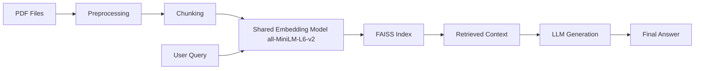

```mermaid
flowchart LR
    A[PDF Files] --> B[Preprocessing] --> C[Chunking] --> D[Shared Embedding Model all-MiniLM-L6-v2] --> E[FAISS Index]
    Q[User Query] --> D
    E --> S[Retrieved Context] --> T[LLM Generation] --> U[Final Answer]
```
