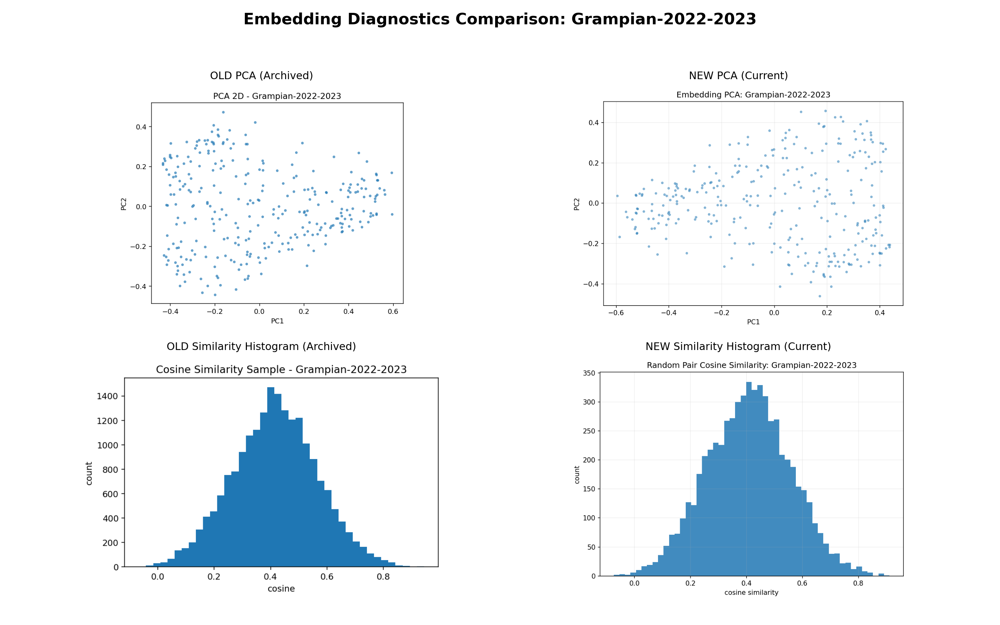
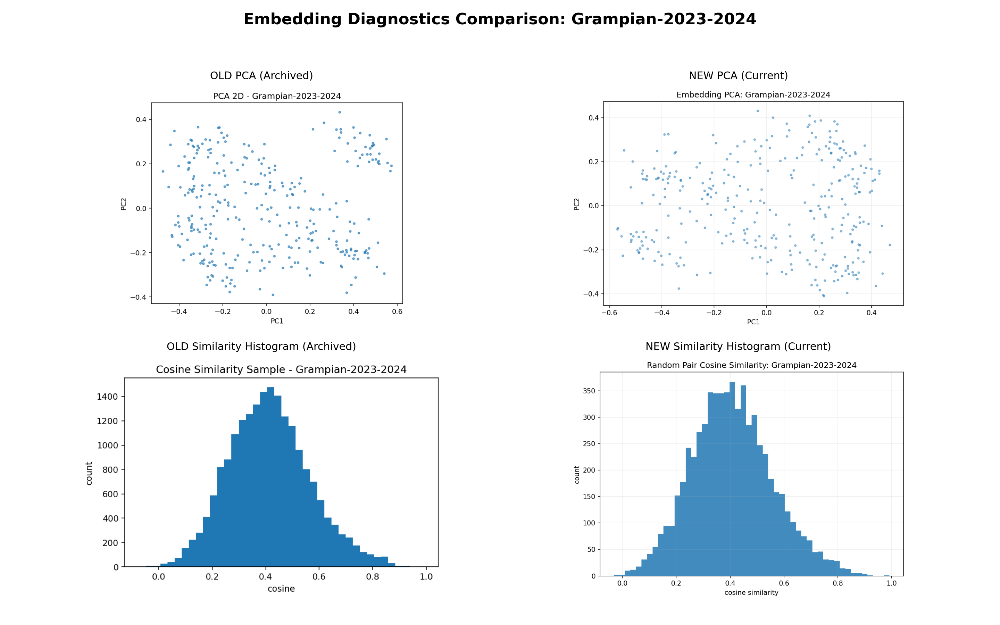
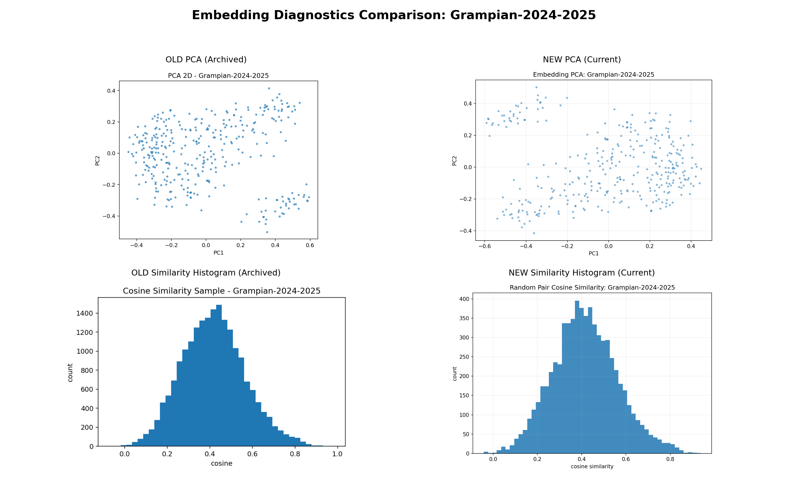

% Viva Deck: Query-Time Use of chunks.parquet and chunk_meta.parquet
% RAG Pipeline

# One Question

## How does a query become a cited answer?

`FAISS row -> chunk_meta -> chunk_id -> chunks text -> LLM answer`

---

# Slide 2: The Two Files

## `chunk_meta.parquet`
- Retrieval-facing metadata
- Row-aligned to FAISS index
- Gives: `chunk_id_global`, `pages`

## `chunks.parquet`
- Full content store
- Gives: `chunk_text`
- Also keeps richer metadata for analysis/debug

## Connection key
- `chunk_id_global` (fallback: `chunk_id`)

---

# Slide 3: Query-Time Pipeline

1. User query is embedded.
2. FAISS returns top row IDs.
3. Row IDs select entries in `chunk_meta.parquet`.
4. Meta provides chunk IDs + page grounding.
5. IDs retrieve full text from `chunks.parquet`.
6. LLM generates answer with citations.

---

# Slide 4: Concrete Example

## Example
- FAISS hit row: `44`
- `chunk_meta` row 44:
  - `chunk_id_global = Grampian-2022-2023:p0102_001`
  - `pages = [102]`
- Use ID to fetch chunk text from `chunks.parquet`.
- LLM answer cites page `102`.

## Why this matters
- Fast retrieval (`chunk_meta`)
- Trustworthy grounding (`pages`)
- Rich answer context (`chunks` text)

---

# Slide 5: Takeaway

`Retrieval and evidence are decoupled:`

- `chunk_meta.parquet` finds and grounds
- `chunks.parquet` provides full evidence text

`Together, they enable accurate, cited answers.`

---

# Slide 6: Old vs New Charts (2022-2023)

---

# Slide 7: Old vs New Charts (2023-2024 and 2024-2025)

