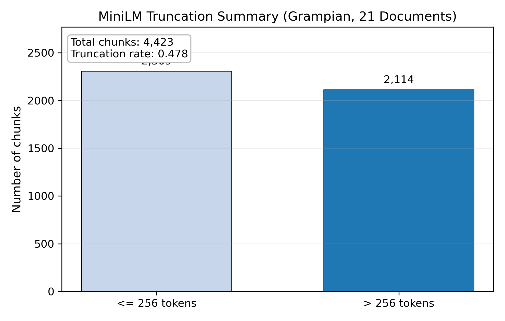
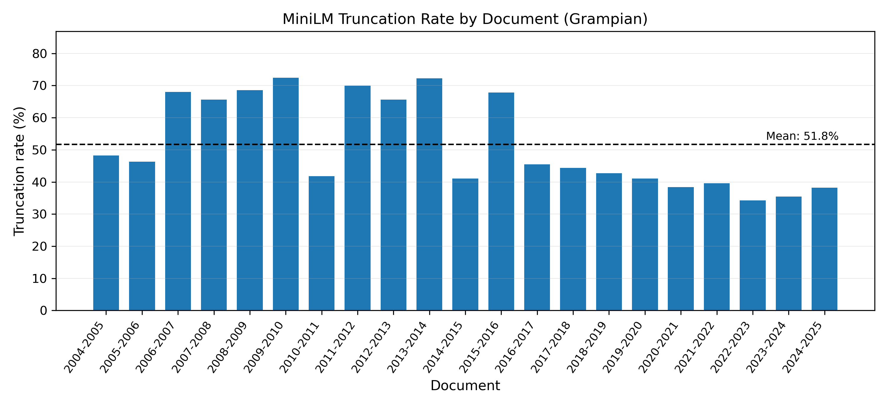

# MiniLM Truncation Validation (Grampian 2004–2025)

Documents: 21
Total chunks: 4,423
Max token length: 8810
Mean length: 462
95th percentile: 1996
Chunks exceeding 256: 2,114
Truncation rate: 0.478

## Example rows

|   tiktoken_tokens |   minilm_tokens | result           |
|------------------:|----------------:|:-----------------|
|               260 |             235 | OK               |
|               260 |             257 | truncated to 256 |
|               260 |             258 | truncated to 256 |

## Visuals

