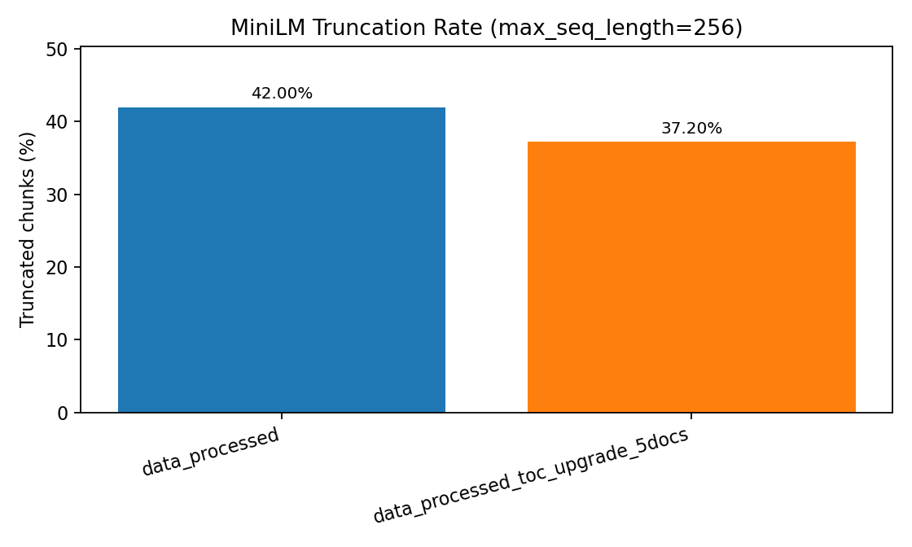

# MiniLM Truncation Validation

## Summary

| dataset_root                     |   max_minilm_token_length |   total_chunks |   truncated_chunks |   truncated_percent |
|:---------------------------------|--------------------------:|---------------:|-------------------:|--------------------:|
| data_processed                   |                       256 |           5740 |               2411 |                42   |
| data_processed_toc_upgrade_5docs |                       256 |           1648 |                613 |                37.2 |

## Example Rows

| dataset_root                     |   tiktoken_tokens |   minilm_tokens | result           | doc_id             | chunk_id   |
|:---------------------------------|------------------:|----------------:|:-----------------|:-------------------|:-----------|
| data_processed                   |               260 |             246 | OK               | Grampian-2014-2015 | p0014_000  |
| data_processed                   |               260 |             259 | truncated to 256 | Grampian-2005-2006 | p0004_001  |
| data_processed                   |               260 |             261 | truncated to 256 | Grampian-2004-2005 | p0045_002  |
| data_processed_toc_upgrade_5docs |               260 |             249 | OK               | Grampian-2020-2021 | p0037_001  |
| data_processed_toc_upgrade_5docs |               260 |             268 | truncated to 256 | Grampian-2020-2021 | p0011_000  |
| data_processed_toc_upgrade_5docs |               260 |             272 | truncated to 256 | Grampian-2020-2021 | p0094_000  |

## Plot

