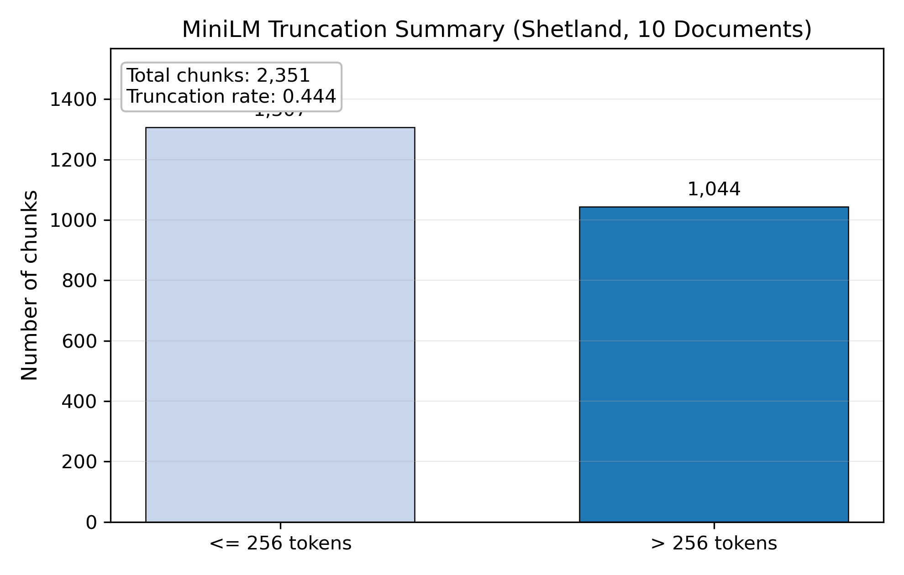
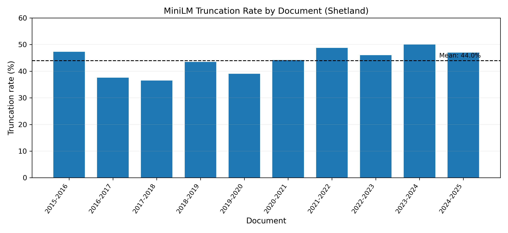

# MiniLM Truncation Validation (Shetland 2015–2025)

Documents: 10
Total chunks: 2,351
Max token length: 5559
Mean length: 510
95th percentile: 2059
Chunks exceeding 256: 1,044
Truncation rate: 0.444

## Example rows

|   tiktoken_tokens |   minilm_tokens | result           |
|------------------:|----------------:|:-----------------|
|               260 |             238 | OK               |
|               260 |             257 | truncated to 256 |
|               260 |             258 | truncated to 256 |

## Visuals

